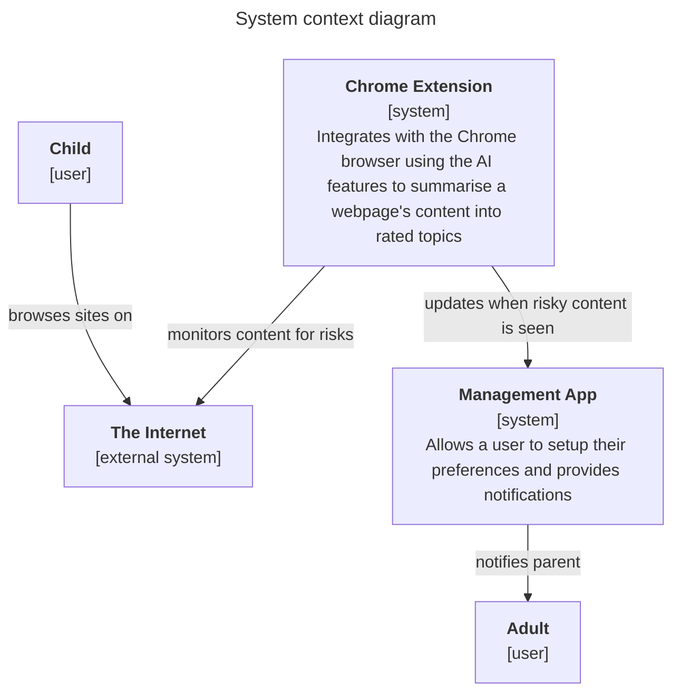

# chrome-nanny

## Purpose
To support children browsing the web by analysing the content of pages they are being exposed to and ranking it for harmful content. Where harmful content is discovered, the extension will offer support to the child and, where appropriate will notify the associated parent.

The intention is to enable parents to be more aware of the potentially harmful content to which their children may be exposed and to enable them to act early to support their children where necessary.

## Design

